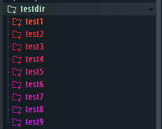
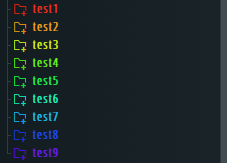

# FL-studio-library-Color-Tool
A python script that colors the library browser folders in fl studio. The script does all the work of generating the .NFO files for each sub-directory, shown on [this forum post](https://forum.image-line.com/viewtopic.php?t=36492). The files generated are placed in the output folder, and the user mmust drag and drop these into the fl studio folder. This was written with Python 3.8.

To run the script, first you will need to edit the param.txt file show below.
~~~
HUE

To switch between gradient and hue modes, change the first line to 'HUE' for hue cycle and 'GRADIENT' 
for gradients between two colors. 

=========================COLOR VARIABLES===============================
Enter the Hex code for each color without the # symbol

C1: 
C2: 

=============================DIRECTORY LOCATIONS=======================
Enter the fl studio sample library directory location below. 
Example: DIRECTORY: C:\path\to\flstudio\sample\library

DIRECTORY: 

Directory location of the folder to place the .nfo files (This could be either a relative or absolute path)
(Currently set to the output folder)

OUTPUT: output/
~~~
Depending on the header, you will fill in the variables for the Gradient or hue section.
[Google's color picker](https://www.google.com/search?q=color+picker) can be helpful to find the color codes for either HSV or Hex formats. For the directory, make sure to follow the format specified with the slashes. The output directory is currently set to the output folder in this directory, but it can be changed. 
## Gradient Example
Gradient computes a linear gradient between the two colors in the RGB coordinate system. This was the outcome with a gradient between \#e82f1e and \#cd20e8. So in the param file:
### at the header:
~~~
GRADIENT
~~~
### In the gradient section:
~~~
=========================COLOR VARIABLES===============================
Enter the Hex code for each color without the # symbol

C1: e82f1e
C2: cd20e8
~~~
Which results in this in the library browser in Fl Studio 
\

## Hue Example
Hue also computes a linear gradient, but it does it in the HSV coordinate system, which means the colors will cycle through the hues of the color wheel to get from the first to the last color.
### at the header:
~~~
HUE
~~~
### In the gradient section:
Using the same two colors from the prior example, 
~~~
=========================COLOR VARIABLES===============================
Enter the Hex code for each color without the # symbol

C1: e82f1e
C2: cd20e8
~~~
Which results in this in the library browser in Fl Studio 
\
 \
Remember to refresh the browser after you run the script!